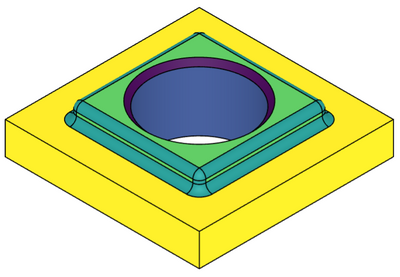
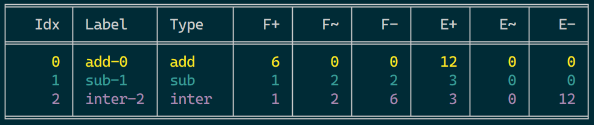

# Bumo

BUild123d Mutables Objects

An experimental package used to manage [Build123d](https://github.com/gumyr/build123d) objects by applying mutations on them.

It can be used:
- just out of curiosity, because it's a new way to build things;
- as a debug tool, using colors and debug mode;
- as a more object-oriented approach to build CAD parts.



## Installation

This package [is registred on Pypi](https://pypi.org/project/bumo/), so you can either install it with Poetry:

    poetry add bumo

or with pip:

    pip install bumo

## Getting started

Bumo is not a cad library on its own and does not aim to replace Build123d, you should take a look at [the Build123d docs](https://build123d.readthedocs.io/en/latest/) before using it.

*Note: In the following examples we will use [ocp vscode](https://github.com/bernhard-42/vscode-ocp-cad-viewer/issues), but any other viewer should work.*

### Instantiating the builder

First, let's instanciate a Bumo builder. Note that we must call the object (`b()`) when passing it to the show function.

```py
import build123d as _
from ocp_vscode import show_object
from bumo import Builder

b = Builder()

show_object(b(), clear=True)
```

At this point you should get a `ValueError: No mutation to show.`, because, hem, there is no mutation to show.

The import lines and show function will be the same in the next examples, so let's ignore them and focus on the builder-related code.

### Adding mutations

When applying an operation, instead of returning a copy of the modified object, the builder mutates the object:

```py
b = Builder()
b.add(_.Box(12, 12, 2))
b.add(_.Box(8, 8, 4))
b.sub(_.Cylinder(3, 4))
```


## Alternative syntax

Alternatively you can use the assignment operators:

```py
b = Builder()
b += _.Box(12, 12, 2) # fuse
b += _.Box(8, 8, 4)
b -= _.Cylinder(3, 4) # substract
b &= _.Cylinder(5, 4) # intersect
```

Note that their counterpart `+`, `-`, `&` are not allowed.

### Listing mutations

You can print the list of mutations and their properties:

```py
b.info()
```

The previous example will produce the following table:



With:
- **Idx**: mutation index;
- **Id**: mutation id;
- **Type**: operation type;
- **Color**: faces color for this mutation;
- **f+**, **f~**, **f-**: amount of added/altered/removed faces on this mutation;
- **e+**, **e~**, **e-**: amount of added/altered/removed edges on this mutation;

### Moving objects

You can move objects with `move()`, all colors will be preserved. Note that you can still use the Build123d `*` operator before passing the object to the builder.

```py
b = Builder()
b.add(_.Box(12, 12, 2))
b.add(_.Box(8, 8, 4))
b.move(_.Location([-5, 2, 0]))
b.sub(_.Rotation(25, 25, 0) * _.Cylinder(2.5, 10))
```


The affectation operator `*=` is available here:

```py
b *= _.Location([-5, 2, 0])
```

### Reusing mutations

Instead of returning a copy of the object, mutations return a `Mutation` object that can be used to retrieve the altered faces and edges. Mutations can also be accessed by querrying a builder index (ie. `b[n]`). This is useful with fillets and chamfers:

```py
b = Builder()
b.add(_.Box(12, 12, 2))
b.add(_.Box(8, 8, 4))
b.fillet(b[-1].edges_added(), 0.4)
hole = b.sub(_.Cylinder(3, 4))
b.chamfer(hole.edges_added()[0], 0.3)
```


### Changing colors

On each mutation you can pass a specific color instead of the auto-generated-one:

```py
b = Builder()
b.add(_.Box(12, 12, 2), "orange")
b.add(_.Box(8, 8, 4), "green")
b.sub(_.Cylinder(3, 4), "violet")
```


### Using the debug mode

You can turn one or several mutations in debug mode, so all the other faces will be translucent. Either by passing a debug attribute to mutations, or passing faces (even removed ones) to the debug method:

```py
b = Builder()
b.add(_.Box(12, 12, 2))
b.add(_.Box(8, 8, 4))
b.fillet(b[-1].edges_added(), 0.4)
hole = b.sub(_.Cylinder(3, 4))
b.chamfer(hole.edges_added()[0], 0.3, debug=True)
b.debug(b[2].faces_altered()[0], "red")
# b.debug(hole.faces_removed(), "red")
```


### Mutation with builders

If necessary it is possible to pass an other builder to a mutation:

```py
b = Builder()
b.add(_.Box(12, 12, 2))

obj2 = Builder()
obj2.add(_.Box(8, 8, 4))

b.add(obj2)
b.sub(_.Cylinder(3, 4))
```

### Configuring the builder

You can configure the builder according to your needs:

```py
Builder.debug_alpha = 0.5
Builder.default_color = "grey"
Builder.color_palette = ColorPalette.INFERNO
```

Options are:

- `autocolor`: Set to True to automatically set a color on each mutation based (default: True)
- `color_palette`: The color palette to use when auto_color is enabled, one of VIRIDIS, INFERNO, MAGMA, PLASMA (default: VIRIDIS)
- `debug_alpha`: The alpha values used for translucent shapes in debug mode (default: 0.2)
- `default_color`: The default color to be used when a color is passed to a mutation (default: "orange")
- `default_debug_color`: The default color to be used when using the debug mode (default: "red")
- `info_colors`: Set to False to disable terminal colors in the info table (default: True)
- `info_table_style`: The [table format](https://github.com/astanin/python-tabulate?tab=readme-ov-file#table-format) used in the info table (default: "fancy_grid")
- `info_hex_colors`: Set to False to show colors in hex format in the info table (default: False)
